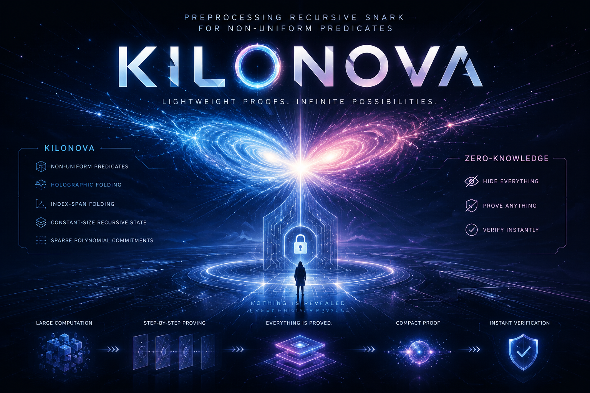

# KiloNova

This is a proof-of-concept implementation of KiloNova for academic use.
Please do NOT use this in the production environment.

# Introduction

KILONOVA is a preprocessing recursive SNARK for fixed sets of non-uniform predicates. By introducing holographic folding schemes and index-span folding, it enables efficient multi-predicate PCD with constant-size recursive states. This repository contains the proof-of-concept implementation of KILONOVA and its core cryptographic components for scalable recursive zero-knowledge proofs.

  

# Development Progress

## Holographic Folding Schemes

1. Implement multi-folding schemes for CCS instances. ✅
2. Generalize the folding scheme to handle instances with non-uniform circuits. ✅
3. Achieve index commitment folding. ✅

## Preprocessing Recrusive SNARK

1. Recursive circuit synthesis for HFS verifier. ✅
2. Index-span folding optimizations. ✅
3. Non-uniform CCS circuit proving. ⏳
